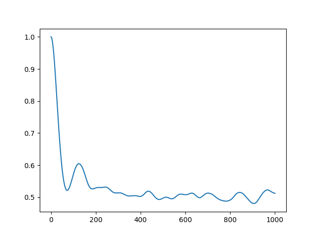

# MLNISE

`mlnise` is a python package with the implementation of the algorithms presented in the paper "Spectral Densities, Structured Noise and Ensemble Averaging within Open
Quantum Dynamics" (add a link here).


## Installation

The first step to install `mlnise` is to clone this repository.

```bash
git clone https://github.com/ausstein/MLNISE.git
```

We recommend creating a virtual environment using either `venv` or `miniconda`. Once the environment is active, installing `mlnise` is straightforward using the package manager [pip](https://pip.pypa.io/en/stable/).

```bash
pip install .
```

## Usage

```python
import mlnise

# include code here
```

or run the sample python script

```bash
python run_mlnise.py
```

this will generate the following graph:



